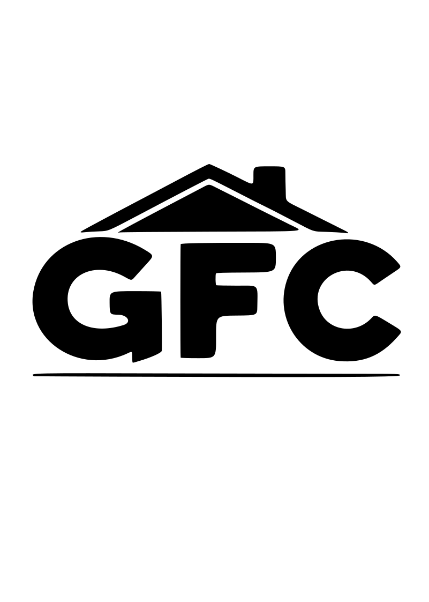

# GFC Exteriors Website

## About This Project

This is the official [website](https://gfc-exteriors.vercel.app) for GFC Exteriors LLC, featuring professional exterior services including siding, gutters, lawn care, pressure washing, and more in the Montevideo, MN area.



## For Non-Technical Users

### What Is This Project?

This is a modern website built for GFC Exteriors using the latest web technologies. It features:
- A responsive design that works on phones, tablets, and computers
- Smooth animations and visual effects
- Contact forms for customer inquiries
- Service information pages
- Fast loading times and good performance

### How To Get Started

If you're not a developer but need to run or test this website on your computer, follow these simple steps:

#### Prerequisites

You'll need to install:
- [Node.js](https://nodejs.org/en/) - Download and install the "LTS" version
- A code editor like [Visual Studio Code](https://code.visualstudio.com/)

#### Installation Steps

1. **Download the project**
   - Save the project folder to your computer

2. **Open a command prompt or terminal**
   - On Windows: Press `Windows key + R`, type `cmd`, and press Enter
   - On Mac: Open the Terminal app from Applications > Utilities

3. **Navigate to the project folder**
   - Type `cd` followed by a space, then drag the project folder into the terminal window and press Enter
   - Example: `cd C:\Users\YourName\Documents\gfc-exteriors`

4. **Install the required software**
   - Type this command and press Enter: `npm install`
   - This will download all the necessary files (this may take a few minutes)

5. **Start the website on your computer**
   - Type this command and press Enter: `npm run dev`
   - This will start the website on your local machine

6. **View the website**
   - Open your web browser
   - Go to [http://localhost:3000](http://localhost:3000)
   - You should now see the website running

7. **Stop the website**
   - When you're done, go back to the terminal
   - Press `Ctrl + C` to stop the local server

### Making Changes

If you need to make simple text or image changes:

1. Look in the project folders for the appropriate files:
   - Text content is mostly found in the `.js` files
   - Images are stored in the `public` folder

2. After making changes, save the files and the website will automatically update (in most cases)

### Getting Help

If you encounter issues or need assistance:
- Check that Node.js is properly installed
- Make sure you typed the commands correctly
- Ask for help from someone with web development experience

## For Developers

This is a [Next.js](https://nextjs.org) project (version 15.2.4) with the following features:

- React 19
- TailwindCSS for styling
- Framer Motion for animations
- ESLint and Prettier for code quality
- Component-based architecture with modular design

### Development Commands

```bash
# Run development server with TurboPack
npm run dev

# Build for production
npm run build

# Start production server
npm run start

# Run linting
npm run lint

# Format code
npm run format
```

### Project Structure

- `/app` - Main application routes and layouts
- `/components` - Reusable UI components
- `/public` - Static assets like images and fonts
- `/styles` - Global CSS and TailwindCSS configuration

### Key Dependencies

- Next.js 15.2.4
- React 19.0.0
- Framer Motion 12.6.2
- TailwindCSS 3.4.1

### Deployment

The site is configured for easy deployment on [Vercel](https://vercel.com), but can be deployed to any hosting platform that supports Next.js.

## License

This project is licensed under the MIT License - see the LICENSE file for details.

## Contact

For questions or inquiries about this website, please contact:
- Email: gfcexteriors@gmail.com
- Phone: 320-226-2128 (Cesar) or 320-435-1703 (Jose)